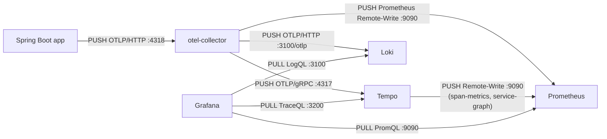

# Telemetry flow architecture

Almost every hop in this pipeline is a push: each piece sends its data onward on its
own schedule, and nothing has to ask it to. The one exception is Grafana, which
pulls — it queries the backends only when someone actually opens a dashboard or an
Explore panel.

## Push hops: app → collector → backends

| Hop | Signal | Protocol | Port | Cadence |
|---|---|---|---|---|
| App → otel-collector | traces | OTLP/HTTP (protobuf), path `/v1/traces` | `4318` | batched, every 5s or on batch-size threshold |
| App → otel-collector | logs | OTLP/HTTP (protobuf), path `/v1/logs` | `4318` | batched, every 1s |
| App → otel-collector | metrics | OTLP/HTTP (protobuf), path `/v1/metrics` | `4318` | every 60s |
| otel-collector → Tempo | traces | OTLP/gRPC | `4317` | forwarded right after its own batch flush |
| otel-collector → Loki | logs | OTLP/HTTP (Loki's native OTLP ingestion) | `3100` | forwarded right after its own batch flush |
| otel-collector → Prometheus | metrics | Prometheus Remote-Write | `9090` | forwarded right after its own batch flush |
| Tempo → Prometheus | span-derived metrics (RED + service graph) | Prometheus Remote-Write | `9090` | Tempo's own metrics-generator interval |

The app never talks to Tempo, Loki, or Prometheus directly. The collector is the
single ingestion point, and everything upstream of it only needs to know one
address: `localhost:4318`. Port `4317` (gRPC) is also published by the collector,
but nothing here actually uses it — the app is configured for OTLP over HTTP end to
end, not gRPC.

## Pull hop: Grafana → backends

Grafana doesn't hold any telemetry of its own. Every graph, log line, or trace it
shows you is fetched live, at query time, from whichever datasource owns it:

| Hop | Query language | Port | When |
|---|---|---|---|
| Grafana → Prometheus | PromQL | `9090` | on dashboard load / Explore query |
| Grafana → Loki | LogQL | `3100` | on dashboard load / Explore query |
| Grafana → Tempo | TraceQL / trace-by-ID | `3200` | on dashboard load / Explore query, or when following a trace-to-logs/trace-to-metrics link |

There's a reason Tempo has two unrelated ports here. `4317`/`4318` is its write
side — the OTLP receiver the collector pushes into. `3200` is its read side, the
query-frontend HTTP API Grafana actually talks to. The two are never on the same
request path.

## The one exception: Prometheus self-scrape

Prometheus also scrapes itself. A single `scrape_config` job named `prometheus`
pulls its own `/metrics` endpoint every 15 seconds, purely for self-monitoring and
unrelated to the app's telemetry. It's the only pull anywhere in this otherwise
all-push ingestion path.
